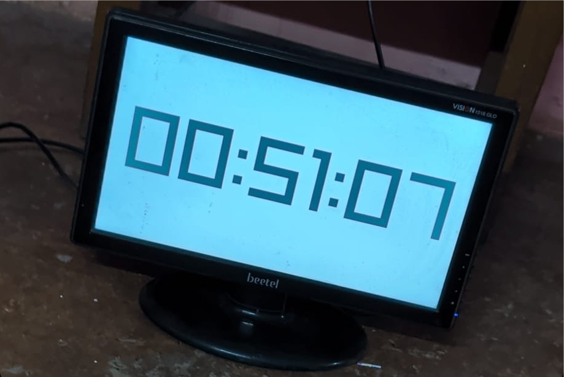

# box

Give life to your old monitors with a Raspbery Pi!

<p >
  
</p>

## Setup

- Flash [Raspberry Pi OS Lite](https://www.raspberrypi.com/software/operating-systems/) using [Raspberry Pi Imager](https://www.raspberrypi.com/software/) on your micro SD card.

- Boot up the Raspberry Pi and connect using SSH or Keyboard

- Install git and clone the repository:

  ```bash
  $ sudo apt-get update
  $ sudo apt-get install git
  $ git clone https://github.com/ish-u/box.git
  ```

- Install [raylib](https://github.com/raysan5/raylib/wiki/Working-on-Raspberry-Pi#compiling-raylib-source-code) with native mode (no X11)

  ```bash
  $ sudo apt install libdrm-dev libegl1-mesa-dev libgles2-mesa-dev libgbm-dev
  $ git clone https://github.com/raysan5/raylib.git
  $ cd raylib/src
  $ make PLATFORM=PLATFORM_DRM
  $ sudo make install
  $ sudo ldconfig
  ```

- Install `libjpeg` - required for [Pillow](https://pillow.readthedocs.io/en/stable/) to install

  ```bash
  $ sudo apt install libjpeg-dev
  ```

- Install [uv](https://docs.astral.sh/uv/getting-started/installation/)

  ```bash
  $ curl -LsSf https://astral.sh/uv/install.sh | sh
  $ source "$HOME/.local/bin/env"
  ```

- Run!

  ```bash
  $ cd box
  $ chmod +x run.sh
  $ ./run.sh
  ```

- You can access the dashboard on `http://HOSTNAME.local:1618` on any other device in your local network to switch skecthes

- Run on boot (optionally)
  - Create a `box.service` and paste the example service (replace USERNAME with your actual username)

    ```
    $ sudo nano /etc/systemd/system/box.service
    ```

    ```
    [Unit]
    Description=Box
    After=network.target

    [Service]
    Type=simple
    User=USERNAME
    WorkingDirectory=/home/USERNAME/box
    Environment="PATH=/home/USERNAME/.local/bin:/usr/local/bin:/usr/bin:/bin"
    ExecStart=/home/USERNAME/box/run.sh
    Restart=always
    RestartSec=10

    [Install]
    WantedBy=multi-user.target
    ```

  - Enable to boot

    ```bash
    $ sudo systemctl enable box.service
    ```

  - Start

    ```bash
    $ sudo systemctl start box.service
    ```

  - Stop

    ```bash
    $ sudo systemctl stop box.service
    ```

  - Check status
    ```
    $ sudo systemctl status box.service
    ```
